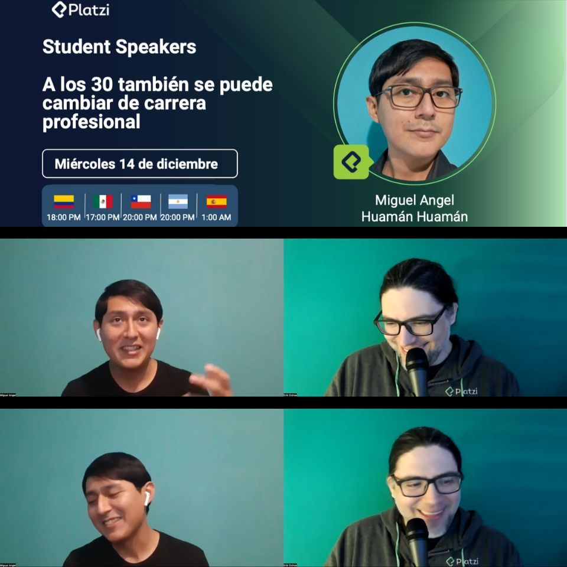

El año pasado tuve la oportunidad de exponer en mi primera charla por Zoom gracias a Platzi.

Decidí compartir mi propia experiencia y hablar de un tema que hubiera deseado escuchar cuando tenía 29 años: "Sí es posible cambiar de carrera después de los 30".

Lo sorprendente fue que decenas de personas se registraron en mi charla. Aunque yo era un desconocido, compartíamos los mismos miedos e inseguridades cuando consideramos un cambio de carrera. Supongo que el título de mi charla logró que muchos se sientan identificados.

Hay una verdad que todos aprendemos en algún momento: "El mercado laboral no nos debe un empleo". Depende de nosotros mismos encontrar nuestro lugar en ese mercado. Es por eso que el reto más difícil de toda entrevista laboral es responder la pregunta ¿Por qué debería contratarte a ti?

Tú puedes ser la persona perfecta para el puesto que deseas, pero si no sabes comunicar de forma efectiva por qué eres la mejor elección, difícilmente lograrás ser seleccionado. Es duro pero cierto. No quiero desmotivarte, sino inspirarte con honestidad, porque nadie te asegurará que cambiar de carrera será sencillo, pero eso no debería detenerte. ¡Yo sé que sí es posible!

Durante mi charla de 15 minutos, compartí ejemplos reales sobre cómo obtener experiencia como voluntario y cómo cada oportunidad, por más pequeña que parezca, puede ayudarte a responder la pregunta más difícil. Cada experiencia se puede convertir en una historia única utilizando técnicas de copywriting y storytelling.

Sin embargo, para destacarte en las entrevistas, es importante hablar bien. Por eso, mi último consejo fue el networking. Aprender a contar nuestra historia en una conversación es fundamental. Pero no existen atajos. Así que todos lo aprendemos a nuestra manera y a nuestro ritmo.

Por ejemplo, yo soy muy callado y aprendí a desenvolverme asistiendo a eventos de tecnología, porque los asistentes a esos eventos siempre están en búsqueda de contactos, socios, clientes o tal vez solo están buscando mejorar su elevator pitch mientras conversan con alguien. En estos eventos tech aprendí a cómo contar mi historia y cómo responder a la pregunta más difícil.

Fue sorprendente ver cómo todos los inscritos se mantuvieron atentos hasta el final de mi charla e hicieron un montón de preguntas. Había logrado conectar con la audiencia. Muchos compartieron lo importante que era escuchar un mensaje sobre la posibilidad de cambiar de carrera incluso cuando te sientes "viejo".

Agradezco a Leomaris Reyes, Erik Ochoa y a todo el equipo de Platzi por darme esta oportunidad única. Siento que he pagado una deuda que tenía con el universo. Siento que logré transmitir el mensaje que me habría gustado escuchar cuando tenía 29 años y decidí cambiar de carrera:

"Aspira a grandes cosas. No te rindas. Sí se puede."

🤩 🚀 🏆

---

- [Enlace a mi publicación original en LinkedIn](https://www.linkedin.com/feed/update/urn:li:activity:7089242839364030464/)
