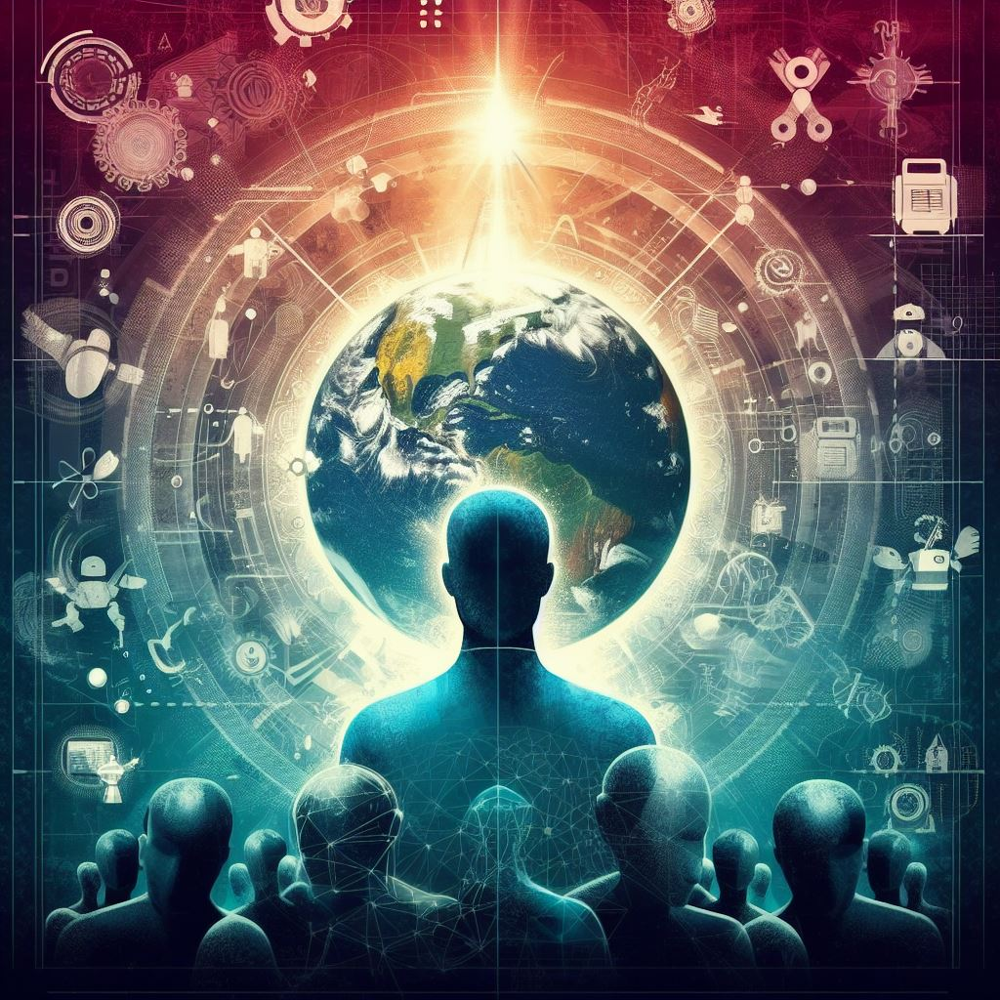
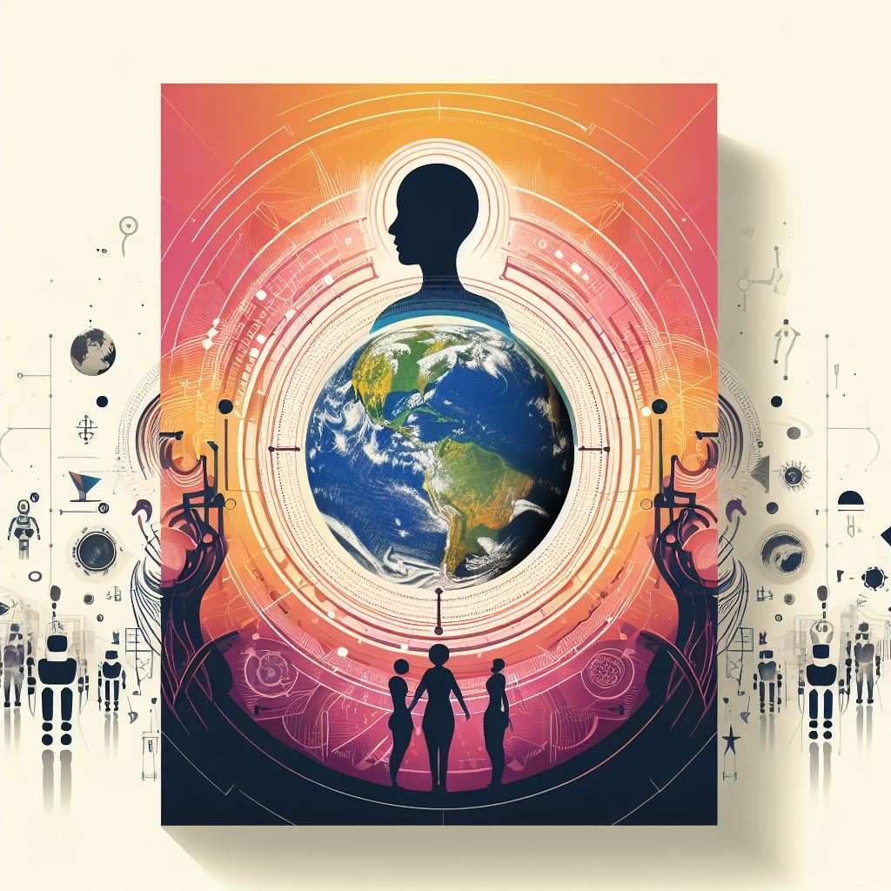

_¿Avanzar sin cambiar de dirección nos lleva a un lugar mejor?_

## Giro Heliocéntrico ☀️🌎

Hace unos milenios, muchas personas creían que vivíamos en el centro del universo y el sol giraba alrededor nuestro. Hasta que Copérnico, Kepler, Galileo y otros astrónomos propusieron teorías que desafiaban esa creencia: "La Tierra no es más que un planeta que gira alrededor del sol". Nos tomó un tiempo aceptar nuestro nuevo lugar en el universo, pero gracias a ese hallazgo, nuevas teorías han mejorado nuestra comprensión del universo.

## Giro Evolutivo 🧬🌿

Hace unos siglos, muchas personas creían que los humanos éramos una especie especial y diferente al resto de animales. Hasta que Darwin, Lamarck, Wallace y otros naturalistas propusieron teorías que desafiaban esa creencia: "Los humanos y todas las especies han evolucionado de ancestros comunes a través de un proceso de selección natural". Nos tomó un tiempo aceptar nuestro nuevo lugar en la naturaleza, pero gracias a ese hallazgo, nuevas teorías han mejorado nuestra comprensión de la biología.

## Giro Psicoanalítico 🧠🕵️‍♂️

Hace unas décadas, muchas personas creían que los humanos podíamos ser completamente objetivos y racionales, con nuestros actos y pensamientos controlados por nuestra mente consciente. Hasta que Freud, Adler, Jung y otros científicos propusieron teorías que desafiaban esa creencia: "Todos somos sujetos subjetivos, con pensamientos influenciados por un inconsciente que no podemos controlar". Nos tomó un tiempo aceptar nuestro nuevo concepto de mente consciente e inconsciente, pero gracias a ese hallazgo, nuevas teorías han mejorado nuestra comprensión de la salud mental.

## ¿Cuál será el siguiente "giro científico"? 🌠💉

Hace unos meses, muchas personas creían que sólo los humanos podíamos generar conocimiento en este planeta. Hasta que GPT-4, Llama 2, LaMDA y otros LLMs desafiaron esa creencia. Yo no sé cuál será el siguiente giro científico de la humanidad. Lo que sí sé es que personas y máquinas serán co-autoras de los próximos "giros", porque cada día hay nuevos hallazgos que sólo son posibles gracias a algoritmos de machine learning:

- Algoritmos como HelioLinc3D descubren asteroides potencialmente peligrosos antes que se acerquen a la Tierra.
- AlphaFold es un programa de IA que predice la estructura en 3D de nuevas proteínas, las cuales se utilizan para desarrollar nuevas medicinas y vacunas.
- Científicos utilizan datasets de imágenes por resonancia magnética funcional (fMRI) para convertir el escaneo de actividad cerebral en palabras. Literalmente ahora se puede leer la mente.

Nos tomará un tiempo aceptar que cada nueva teoría y paper académico podría ser escrito por una persona o por una IA y no podremos diferenciarlo. Porque después de todo, ¿Tú no puedes diferenciar cuáles de las palabras en este artículo fueron seleccionadas por una persona o por una IA?

¿O sí? 🤯🤖✍📚
